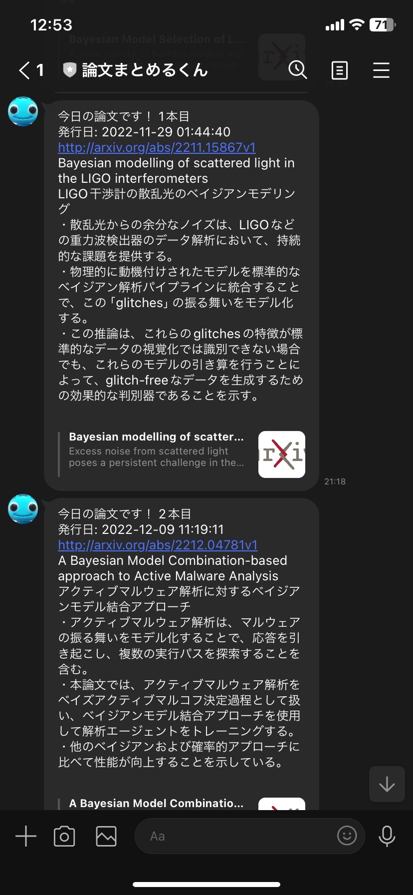

# LINE-bot-arxiv

This code enables us to get summarized information about latest papers as to your preferred topic from arXiv via LINE using GPT.  
in the code, bayesian modeling is a default searching topic.
This code uses arXiv API to get information  about latest papers, openAI API to summarize them, and LINE messaging API to send them via LINE to you.  

arXiv上にある最新の学術論文をchatGPTによって要約し、それを定期的に自動で送信するLINEbotを作成しました。  

それぞれのサービスのAPIをPythonで処理するスクリプトを作成し、それをGoogle Cloud Pratformによって運用する方式を取っています。

